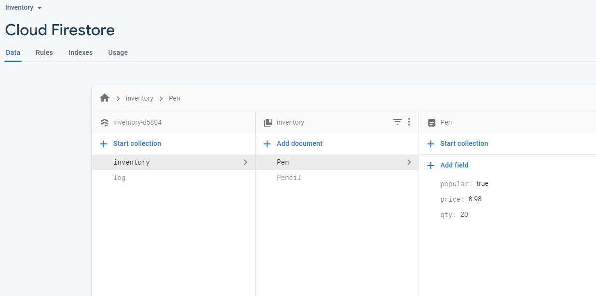
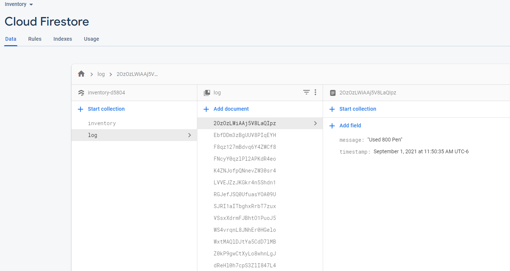
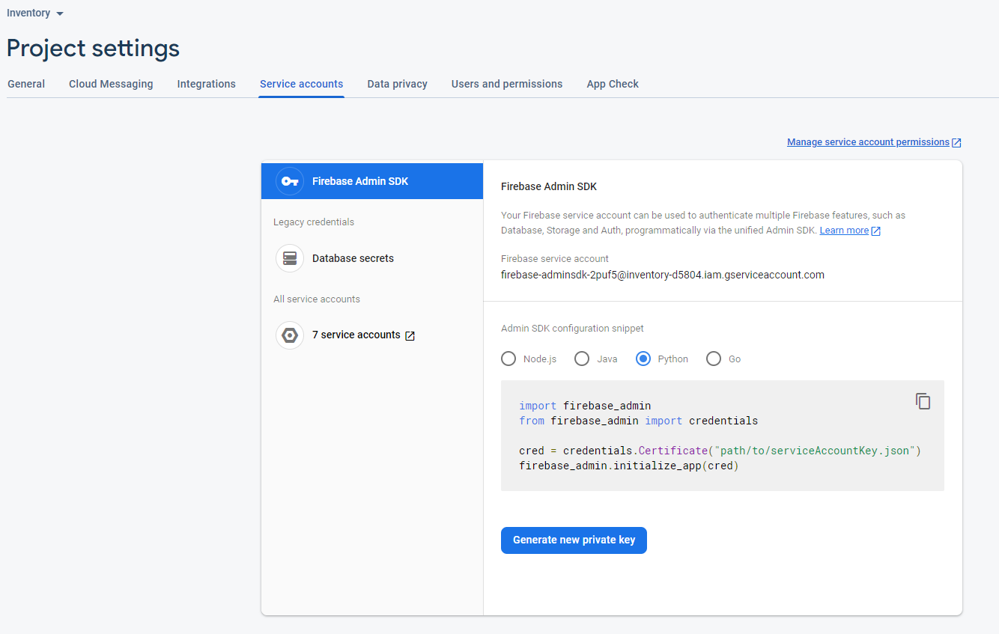

# CSE 310 – Cloud Database Workshop

## Example Classroom Code

* Starting Code: https://replit.com/@cmacbeth/CSE310CloudDBWorkshop
* Solution Code: https://replit.com/@cmacbeth/CSE310CloudDBWorkshopSolution

## Useful Reference Links

* https://firebase.google.com/docs/firestore
* https://towardsdatascience.com/nosql-on-the-cloud-with-python-55a1383752fc

## Firestore Structure

Firestore is a non-SQL (or key/value pair) cloud database provided by Google.  In firestore, instead of table, columns, and rows, we have collections, documents, and fields.



A collection is like a table.  Each document in a collection is like a row in a table.  Each field in a document is like a column value in a row of a table.

Each document name (or ID) must be unique.  The name could be meaningful like the picture above or the name could be an auto-generated value like the picture below.  The auto-generated values are guarenteed to be unique.



## Python Firestore Library

The `firebase_admin` library provides all of the functions to communicate to Firestore using Python.

### Initialization

To initialize the connection, you will need to download the service account json file.  To find this on the Firestore website, goto the Project Settings, select the Service Accounts tab, press Create Service Account, and the prses Generate New Private Key.



The json file will download.  You must include this file with your code but you should not put this file into GitHub as it contains private information. 

In your source code, you need to use this file to initialize firestore. 

```python
# Setup Google Cloud Key - The json file is obtained by going to 
# Project Settings, Service Accounts, Create Service Account, and then
# Generate New Private Key
os.environ["GOOGLE_APPLICATION_CREDENTIALS"]  = "YOUR_FILE_NAME_HERE.json"

# Use the application default credentials.  The projectID is obtianed 
# by going to Project Settings and then General.
cred = credentials.ApplicationDefault()
firebase_admin.initialize_app(cred, {
    'projectId': 'YOUR_PROJECT_NAME_HERE',
})

# Get reference to database
db = firestore.client()
```

### Writing Data

When we write to Firestore, we must specify the collection, the document, and the fields.  The fields are represented by a Python dictionary.

```python
data = {"price" : price, 
        "popular" : popular,
        "qty" : qty}
```

The document can either be specified (make sure its unique if you are adding new data) or auto-generated.  The code below will either create a new Pencil document or will update a pre-existing Pencil object with the dictionary data.

```python
db.collection("inventory").document("Pencil").set(data)
```

If you wanted to update a single field in a document, the `update` function can be used as well.

```python
db.collection("inventory").document("Pencil").update({"price" : 0.99})
```

To create an auto-generated document ID, we need use the `add` function instead of the `set` function.  If we want to update a document that had an auto-genereated ID, then we need to save that ID number and use the `set` function like.

```python
db.collection("log").add(data)
```

### Reading Data

Reading data from a document requires the use of the `get` function.  To check if data was successfully read, then the `.exists` attribute can be checked.  The result that comes back can be convereted to a dictionary for easier use by using the `to_dict()` function.

```python
result = db.collection("inventory").document("Pencil").get()
if result.exists:
    print("Pencil exists in the inventory.")
    data = result.to_dict()
    print(data)
else:
    print("Pencil does not exist in the inventory.")
```

If you want to query for some or all of the documents, then the `get` function can be used on the collection.  The results can be used with a for loop.  The fields of each document in the results returned from the query can be accessed with the `to_dict()` function.  If you want the document name, you can use the `.id` attribute.

```python
all_results = db.collection("inventory").get()
for result in all_results:
    data = result.to_dict()
    print(f"ID: {result.id}")
    print(f"Fields: {data}")
```

The `where` function can be used to query for specific documents in a collection.  You can chain multiple `where` functions together.  The `where` functions takes 3 parameters that make up a boolean expression.  

```python
results1 = db.collection("inventory").where("price", "<=", 5.00).get()
results2 = db.collection("inventory").where("popular", "==", False).where("price", ">=", 100.00).get()
```

The second example above will require that an index be created on the Firestore website.  The error message you will receive prior to creating the index will provide a URL to auto-create the index.

### Real-Time Data Notification

You can register for notifications based on a query.  For example, this code will call the `notify_bad_price` if any of the documents has a price field less than or equal to 0.  The call to `notify_bad_price` will be asynchronous and on a separate thread.

```python
db.collection("inventory").where("price", "<=", 0).on_snapshot(notify_bad_price)
```

The callback function `notify_bad_price` must have 3 parameters to hold the data results, a summary of what changed, and the time the data was read. If you need to refresh your data, then the data results should be used.  The data results will contain the full result of the query. If you want to do something different based on whether something was added, modified, or removed from the query, then changes should be used.

* ADDED = New document added to the query results
* MODIFIED = Already existing document in the query results was modified
* REMOVED = Previously existing document in the query results was removed

```python
def notify_bad_price(results, changes, read_time):
    for change in changes:
        if change.type.name == "ADDED": 
            print(f"Item Added to the Query: {change.document.id}")
        elif change.type.name == "MODIFIED":
            print(f"Existing Item in Query was Modified: {change.document.id}")
        elif change.type.name == "REMOVED":
            print(f"Previously Existing Item in Query was Removed: {change.document.id}")
```

### Deleting Data

To remove a document, we use the `delete` function.  We can also use the `update` function if we want to remove a single field within a document.  When deleting a single field, we use the `firestore.DELETE_FIELD` value.

```python
db.collection("inventory").document("Pencil").delete()

db.collection("inventory").document("Toaster").update({"price" : firestore.DELETE_FIELD})
```
