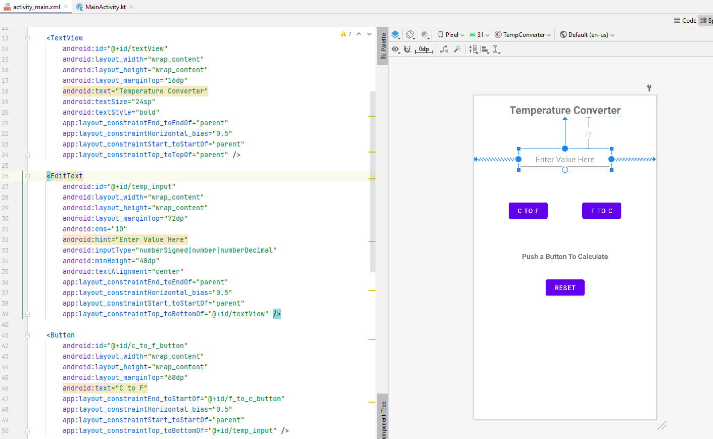

# CSE 310 – Kotlin Workshop

## Example Classroom Code

* Starting Code: We will start with a new project in Android Studio
* Solution Code: https://github.com/macbeth-byui/TempConverter

## Useful Reference Links

* https://developer.android.com/
* https://developer.android.com/codelabs/build-your-first-android-app-kotlin#0
* https://developer.android.com/courses

## Development Environment

Android Studio is a good place to begin developing native Android apps using either Java or Kotlin:

* https://developer.android.com/studio

Android Studio will already come with Java and Kotlin.  As part of the installation process, the following will also be installed:

* Android Emulator - You can use the emulator if you don't have an Android Phone
* Android SDK - Android will regularly release a new version of the SDK which you can use to build your software app.  The SDK is also used to load the Android operating system onto your emulated phone.

## Basics of App Development

### Activity Screen

Every screen you see on an Android App is related to a class that inherits from the `Activity` class.  For backwards compatibility reasons, we usually inherit from `AppCompatActivity`.

```kotlin
class MainActivity : AppCompatActivity() {
    override fun onCreate(savedInstanceState: Bundle?) {
        super.onCreate(savedInstanceState)

        // Associate the layout XML with this activity so we know what to draw
        setContentView(R.layout.activity_main)
```

The `onCreate` function is the first function that is called when the activity screen is started by Android.  The `setContentView` function associates your activity screen with a layout xml file.  The layout XML provides the graphical interface for the activity screen.  You can design your XML with a "drag and drop" system or (if you are savvy enough) via the XML directly.




The default layout is called the `ConstraintLayout` which requires you to constrain each item horizontally and vertically with respect to either the sides of the phone or to other components.

### Connecting Code with Layout

The layout will contain input and output components which you can use to interact with the user.  The code in your activity class will need to respond to button clicks, read typed inputs, or many other things.  The first step is to obtain a code object that represents the current state of the component in your layout.  

```kotlin
val c_to_f_button = findViewById<Button>(R.id.c_to_f_button)
val temp_input = findViewById<EditText>(R.id.temp_input)
val temp_output = findViewById<TextView>(R.id.temp_output)
```

The `findViewById` function connects the component id from the layout XML to an object of a class.  For example, the button named `c_to_f_button` in the layout can be referenced using the auto-generated resource structure `R.id.c_to_f_button`.  If you provide this id to the `findViewById` (and properly specify the class type which in this case is `Button`) then you will get an object representing that button.

### Listening to Events

Android uses the Observer Design Pattern (or a listener) to allow you to respond to events that the user may peform in your app.  For example, if you want to respond to button click by calling your private `convert_c_to_f()` function that you wrote in your Activity class, you would do the following:

```
val c_to_f_button = findViewById<Button>(R.id.c_to_f_button)

c_to_f_button.setOnClickListener { convert_c_to_f() }
```

### Using Layout Objects

If you have an object from the layout, you can use it to modify what is displayed on the activity screen.  For example, to change a `TextView`:

```kotlin
val temp_output = findViewById<TextView>(R.id.temp_output)
val f_temp = 100.0f
temp_output.text = "${"%.1f".format(f_temp)} F"
```

To read a value from an `EditText`:

```kotlin
val temp_input = findViewById<EditText>(R.id.temp_input)
val c_temp = temp_input.text.toString().toFloat()
```

### Changing Screens

If you want more than one Activity Screen, you have to create a new Activity class with an layout XML.  When you want to go between screens, you have to create an `Intent` object.  An `Intent` specifies where you are coming from (we call this the current context), where you are going (the new Activity class), and any other information you want to share (think of this information like passing variables between functions).

```
val intent = Intent(this, OtherActivity::class.java)
intent.putExtra("Message","Just saying Hello...")
```

In this example, we are sending a message to the other activity.  In the `onCreate` of the other activity, we need to read the message.

```
val message = intent.getStringExtra("Message")
```

If you want to go back to the previous screen, just call the `finish()` function.

### Other Stuff

The Android SDK contains many things including support for databases, sensors, graphics, and many other things.  One useful approach to searching on the web is: `android kotlin <what i want to do>`.